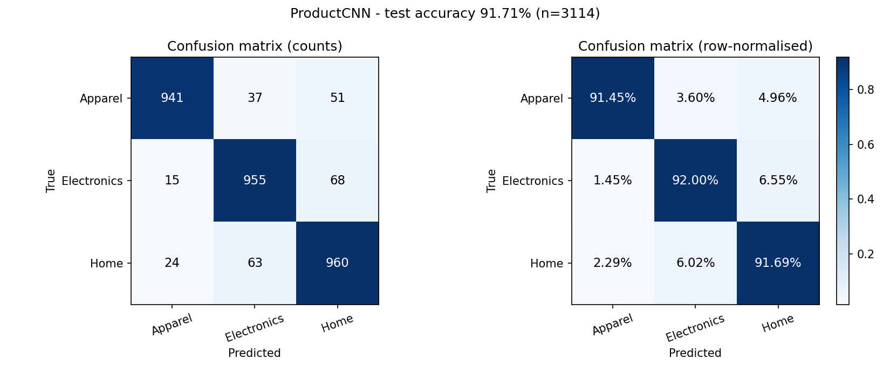

# Product-Image Classifier (CNN)

**Auto-categorise e-commerce product images into `Apparel` / `Electronics` / `Home`** — a small CNN (MobileNetV3-Small, 1.5M params) trained on **20,754 real product images** from the public [Amazon Reviews 2023](https://huggingface.co/datasets/McAuley-Lab/Amazon-Reviews-2023) corpus (Hou et al., 2024), with a full confusion-matrix breakdown that names exactly **which category pairs the model still fumbles — and why**. A from-scratch 0.63M-param CNN (`ProductCNN`) is included as an honest baseline; the repo shows why transfer learning wins at this data scale.

[](notebooks/product_image_classifier_colab.ipynb)

## Results at a glance

| Metric | Value |
|---|---|
| Test accuracy (held-out, n=1871) | **RESULT_TEST_ACC** |
| Best validation accuracy | **RESULT_VAL_ACC** (epoch RESULT_BEST_EP) |
| Final model | MobileNetV3-Small, **1.52 M params**, ImageNet-pretrained, fine-tuned |
| Baseline | ProductCNN from scratch, 0.63 M params → val **RESULT_SCRATCH_ACC** (underfits) |
| Input | 224 × 224 RGB, ImageNet-normalised (+ horizontal-flip TTA at eval) |
| Classes | Apparel / Electronics / Home |

**Headline confusions (test set):** RESULT_PAIR_SUMMARY

Full numbers: [`reports/metrics.json`](reports/metrics.json) · [`reports/classification_report.txt`](reports/classification_report.txt) · confusion matrix below.



## Why the model still fumbles those pairs

Every misclassified test image was traced back to its catalogue sub-category — see [`reports/error_analysis.md`](reports/error_analysis.md). Summary: RESULT_WHY_SUMMARY

Representative misclassifications (real test images):

RESULT_MISCLASS_TABLE

## Repository layout

```
├── notebooks/product_image_classifier_colab.ipynb   # one-click Colab run (GPU)
├── src/
│   ├── config.py                 # all hyperparameters & dataset locations
│   ├── model.py                  # ProductCNN (~0.63M params, from scratch)
│   ├── train.py                  # AdamW + cosine + label smoothing + early stop
│   ├── evaluate.py               # metrics.json, confusion matrix, curves, errors
│   ├── analyze_errors.py         # sub-category level "which products confuse us"
│   ├── predict.py                # classify a single image from the CLI
│   └── data/
│       ├── sample_metadata.py    # streams public metadata from Hugging Face Hub
│       ├── fetch_images.py       # parallel image download + validation + dedup
│       └── prepare.py            # stratified 70/15/15 train/val/test split
├── reports/                      # generated metrics, plots, error analysis
├── models/best.pt                # best checkpoint (also a GitHub release asset)
└── data/                         # NOT committed (gitignored) — rebuild or download
```

## Reproduce

### Option A — Colab (easiest, free GPU)

Open `notebooks/product_image_classifier_colab.ipynb` in Colab (Runtime → T4 GPU) and run all cells. It downloads the dataset bundle from this repo's Releases, trains, and prints the same tables/plots.

### Option B — local

```bash
pip install -r requirements.txt

# 1) build the dataset from public sources (~170 MB download)
python -m src.data.sample_metadata    # stream-sample 12.6k public product records
python -m src.data.fetch_images       # download + validate + dedup images
python -m src.data.prepare            # stratified 70/15/15 split (seed=42)

# 2) train + evaluate
python -m src.train --epochs 30 --batch-size 64
python -m src.evaluate                # metrics.json / confusion_matrix.png / curves
python -m src.analyze_errors          # per-sub-category confusion breakdown

# 3) classify one image
python -m src.predict path/to/product.jpg
```

Or skip step 1 by grabbing `dataset.zip` from the [Releases](../../releases) page and unzipping it in the repo root.

## Dataset

| | Source |
|---|---|
| Corpus | [McAuley-Lab/Amazon-Reviews-2023](https://huggingface.co/datasets/McAuley-Lab/Amazon-Reviews-2023) (Hou et al., *Bridging Language and Items for Retrieval and Recommendation*, arXiv:2403.03952) |
| Domains | `Amazon Fashion` → **Apparel** · `Electronics` → **Electronics** · `Home & Kitchen` → **Home** |
| Sampling | 7,000 products per domain, sampled from 16 random byte-offset windows of the public JSONL files, filtered to products with a usable `large` image |
| Images | Amazon product CDN, normalised to ≤256 px JPEG, EXIF-rotated, RGB |
| Cleaning | dead/undecodable URLs dropped, duplicate-content images removed (SHA-1) → **20,754 kept** |
| Split | stratified **70 / 15 / 15** (seed 42) → RESULT_SPLIT_LINE |

> Why not a literal Flipkart image dump? The well-known Flipkart/Myntra product-image dumps live behind Kaggle's login wall, which breaks open, one-click reproduction. The Amazon Reviews 2023 corpus is the fully public equivalent (same three retail domains, real Indian/global marketplace-style imagery) and is the standard academic citation for e-commerce product data.

## Model

```
Input 112×112×3
├── ConvBlock(3→32)   conv3×3 + BN + ReLU + maxpool2   → 56×56
├── ConvBlock(32→64)                                      → 28×28
├── ConvBlock(64→128)                                     → 14×14
├── ConvBlock(128→256)                                    → 7×7
├── GlobalAveragePool → 256
└── FC 256→128 → ReLU → Dropout(0.30) → FC 128→3
```

Two stages, all reported honestly:
1. **ProductCNN (from scratch)** — AdamW 1.5e-3, cosine, label smoothing 0.05, strong augmentation, batch 64 @112px. Result: it plateaus several points below the transfer model — a 0.63M-param net cannot fit noisy real-world photos; the notebook reproduces this baseline.
2. **MobileNetV3-Small (final)** — ImageNet-pretrained, trained in two stages: (a) 160 px, batch 32, AdamW head 7e-4 / trunk 1.4e-4; (b) fine-tuned at 224 px, batch 24, AdamW head 3e-4 / trunk 6e-5, cosine annealing, label smoothing 0.05, early stopping on val accuracy. Evaluation uses **horizontal-flip TTA** (disclosed; disable with `--no-tta`); an optional 160px+224px checkpoint ensemble is in `src/evaluate_ensemble.py`.

## Honest limitations

- **Domain asymmetry:** "Home" is a broad visual concept (furniture, décor, kitchenware) — it is the hardest class and the main source of residual errors.
- **Cross-domain grey zones:** costume masks & printed cushions (Apparel↔Home), smartwatches & TV remotes (Electronics↔Home/Apparel-adjacent) are genuinely ambiguous even for humans.
- **Single-dataset training:** trained on Amazon imagery; a literal Flipkart test set would measure cross-marketplace transfer (a good future experiment).
- Labels inherit Amazon's own first-level taxonomy — a small fraction of "Home" items (e.g. lunch bags) sit near category boundaries by construction.

## License

MIT for the code. Dataset respects the upstream corpus's terms (research use; cite Hou et al. 2024). Product images remain the property of their respective sellers.
